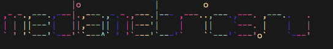
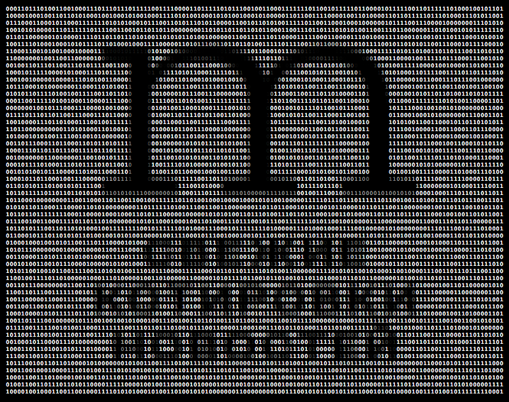
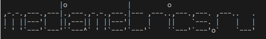
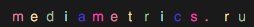
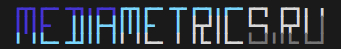
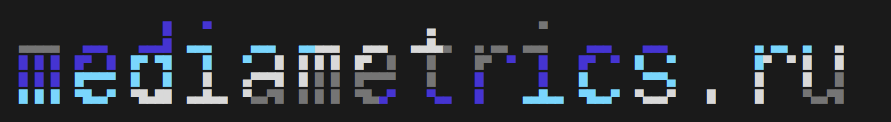

# mediametrics terminal client





```
Консольный клиент для **http://mediametrics.ru**

В первую очередь надо сделать публичный Rest API, клиента уже писать к нему.
Это архиважно для нас технарей, очень-очень.

Прежде всего предлагаю писать на node.js или на golang. ( я больше склоняюсь к golang )
Основная идея клиента в возможности просмотра ленты новостей из консоли для технарей.
```

* Основной функционал
 * возможность детализации по конкретной новости
 * список последних новостей
 * список последних статей
 * также изучать содержимое рубрик
 * возможность внесения новости в закладки
 * публикация в сервисах (ФБ, VK, TW)
 * рейтинги компаний, агенст и прочего
 * поиск по новостям
 * псевдографики

* Наброски:
 * архиважно запилить отслеживание  нотификацию по тегам
 * параметры ограничивающие кол-во вывода
 * blacklist для определенных новостей
 * возможность самостоятельной смены цветовой схемы
 * транспорт в slack и hipchat
 * админский ssh сhat c транспортом в общий чат
 * транспорт в IRC ( мегафункция )
 * пушить отслеживаемые новости в github
 * интеграция с  Homebrew, apt-get, yum, и прочими пакетами
 * сортировка новостей по источникам (например по habrhabr)
 * встроить возможность откладывания статьи для прочтения на потом с НАПОМИНАНИЕМ

* Радио:
 * возможность просмотра прошедших и будующих передач
 * возможность поставить себе напоминание о передачи
 * запись передачи на диск
 * оценка передачи

* Несколько типов интерфейсов:
 * Простой консольный ( запускается один раз, выдает новости и другую информацию )
 * Интерактивный новостной интерфейс
 * Интерфейс радио, сразу с чатом и другими плюшками

* Другое
 * Возможность авторизации для комментирования.
 * Возможность генерирования SSH ключа и привязка его к аккаунту в интернете
 * Новости по SSH для TRUE админов
 * Нотификация с напоминанием работает на нашей стороне ( на стороне сервера )

* Конфиг
 * Возможность переноса ВСЕХ опций в конфигурационный файл

## Usage

```
Usage: metrics [commands/options]

Commands:

  metrics           	    Вывести последние новости
  metrics <time>    	    Вывести новости за определенное время
  metrics <type>    	    Тип выводимых новостей. ( По умолчанию hitech  )
  metrics <url>     	    Вывести определенную новость
  metrics search <word>  	Поиск новостей по ключевому слову

Options:
  -s, --short       Вывести краткую сводку
  -v, --version    	Показать версию
  -h, --help       	Вывести справку
  -o, --output      Формат вывода новостей (xml, csv, ancii)

Categories:        	news, sport, tech, People,
```
## License

GNU General Public License, version 2.0 (GPL-2.0)

## Logo












